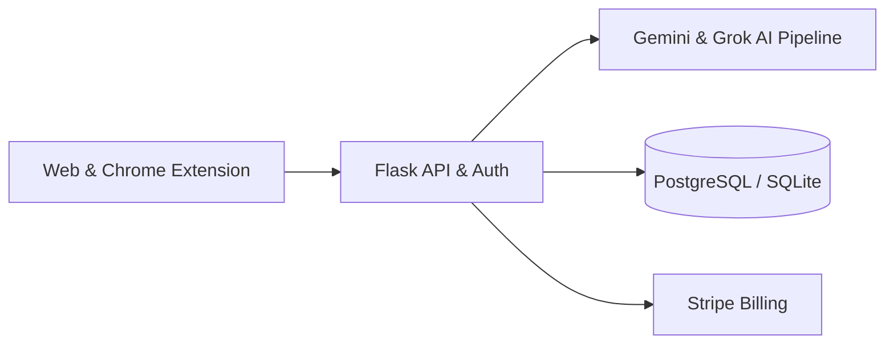

# Authenix

> **Note:** Formerly known as **SatoriCheck**. The internal project directory (`satoricheck/`) retains the legacy name for container and deployment stability. And because I was too lazy to redo everything all over again.

Authenix is my AI-powered verification platform for live audio streams, text claims, pitch decks, and media analysis. I am building towards a live stream verification, where you can let it run on the side while someone speaks, and it will flag suspicious claims and verify them for you. But all in due time, this is a weekend project. If you have inputs on how to improve it, I am all ears.

**Stack:** Python 3.12 (Flask), Vanilla JS, Google Gemini, xAI Grok, PostgreSQL

---

## Features

- **Live Audio & Text Verification**: Real-time speech stream transcription and claim extraction via Gemini.
- **Pitch Deck & Media Forensics**: Presentation claim validation and AI-generated image/video manipulation analysis.
- **Multi-Source Grounding**: Multi-agent reasoning pipeline grounded in Google Search and xAI Grok.
- **Chrome Extension (MV3)**: Persistent side panel with 1-click Google OAuth and contextual verification.
- **Gamification & Billing**: Daily login streak rewards, check points (CP), and Stripe checkout integration.
- **Privacy & GDPR Compliance**: Ephemeral media processing and automated retention cleanup. 

---

## Local Setup & Prerequisites

### Prerequisites
- Python 3.11+
- Virtual environment (`.venv`) at repository root

### Quick Start

```bash
# 1. Install dependencies
cd satoricheck
pip install -r requirements.txt

# 2. Configure environment
cp .env.example .env    # Configure GEMINI_API_KEY, FLASK_SECRET_KEY

# 3. Start development server
python3 -m backend.server
```

Open **http://127.0.0.1:8000** in your browser.

> Set `TEST_MODE=true` in `.env` for local mock testing without live API keys.

---

## Testing

Run the test suite from the repository root:

```bash
pytest satoricheck/tests/ --ignore=satoricheck/tests/e2e
```

---

## Architecture Overview


```mermaid
graph LR
    Client[Web & Chrome Extension] --> API[Flask API & Auth]
    API --> AI[Gemini & Grok AI Pipeline]
    API --> DB[(PostgreSQL / SQLite)]
    API --> Stripe[Stripe Billing]
```

- **Frontend:** Vanilla JavaScript (ES6+), HTML5, and CSS3 custom properties (mobile-first, dark theme).
- **Backend:** Modular Flask blueprints (`auth`, `billing`, `factcheck`, `tokens`).
- **Database:** SQLAlchemy ORM with SQLite (WAL mode) locally and Cloud SQL (PostgreSQL) in production.
- **AI Engine:** Google Gemini (multimodal audio, thinking loops, search grounding) with xAI Grok integration.

---

## Legal & License

- [Privacy Policy](https://gist.github.com/defluff/bccc4d328f850de6eec1521ba4c2be22) & [Terms of Service](https://gist.github.com/defluff/bccc4d328f850de6eec1521ba4c2be22)

- All rights reserved. Source-available for portfolio and educational review. If you use this without giving credit, I will karma you so that you stomp your pinky-toe on the bedstand every night henceforth.